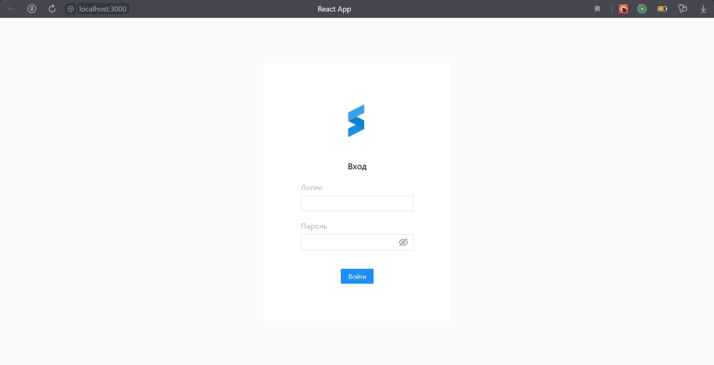
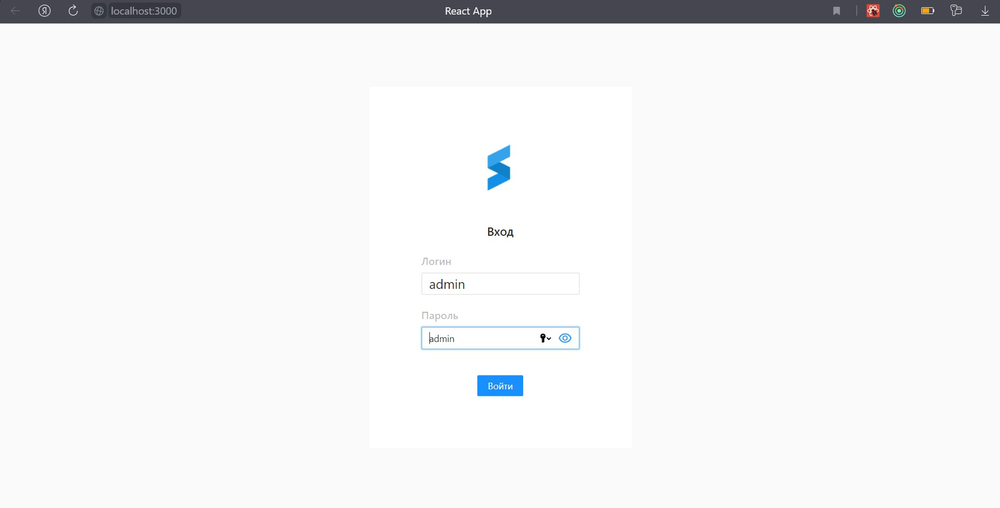
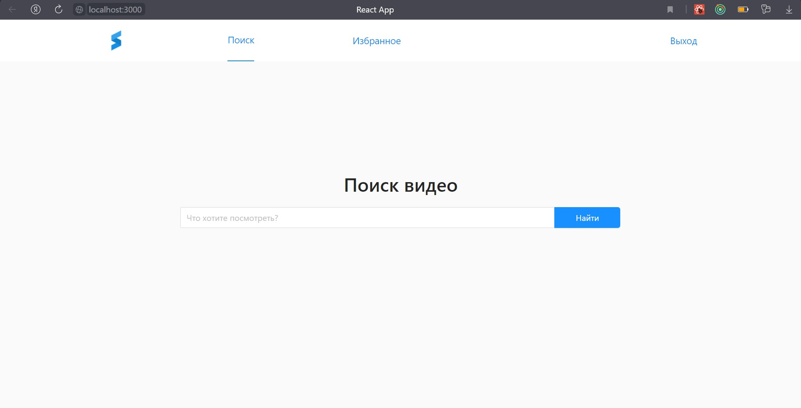
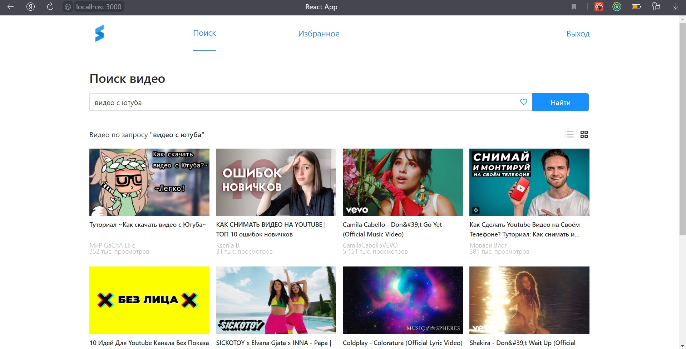
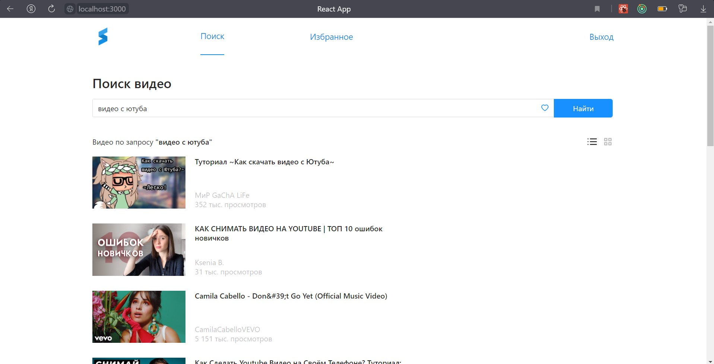
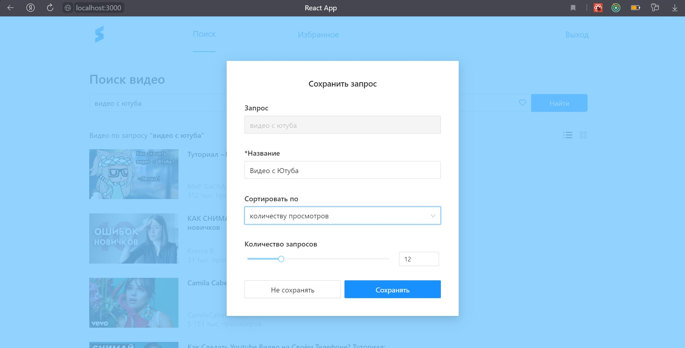
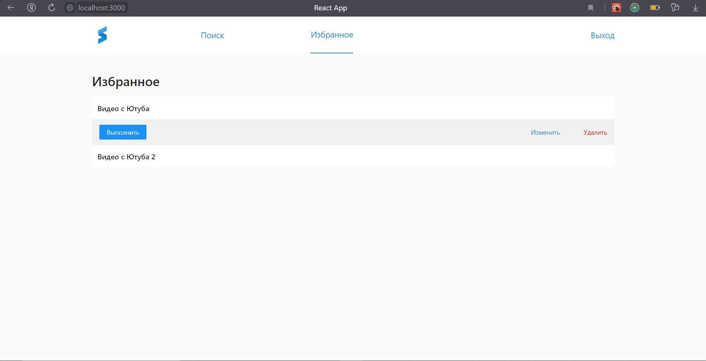
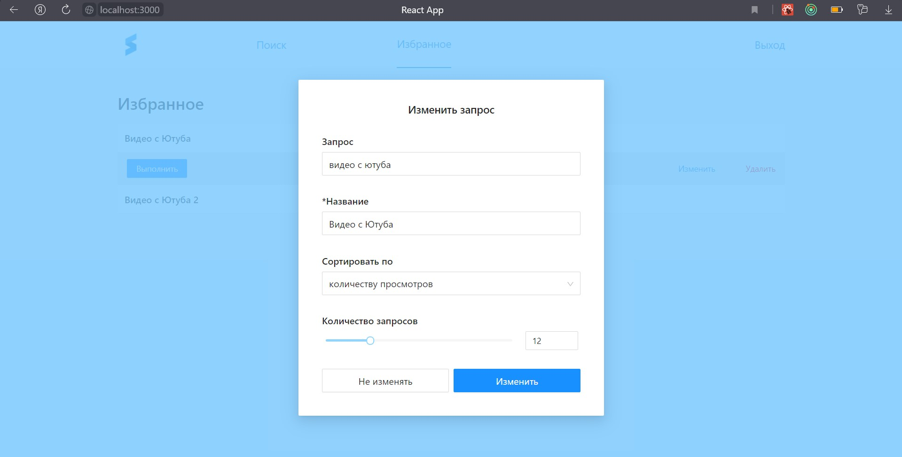

## Чтобы развернуть приложение, необходимо:

1 - установить все зависимости

### `npm install`

2 - запустить проект

### `npm run serve`

## Приложение будет доступно по ссылке:

### `http://localhost:3000/`

## Тестовое задание не предусматривает регистрации, а поэтому для авторизации используйте следующие 2 аккаунта:
#### `login: admin `   
#### `password: admin` 
или
#### `login: user`
#### `password: user`

